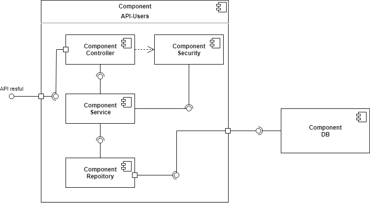
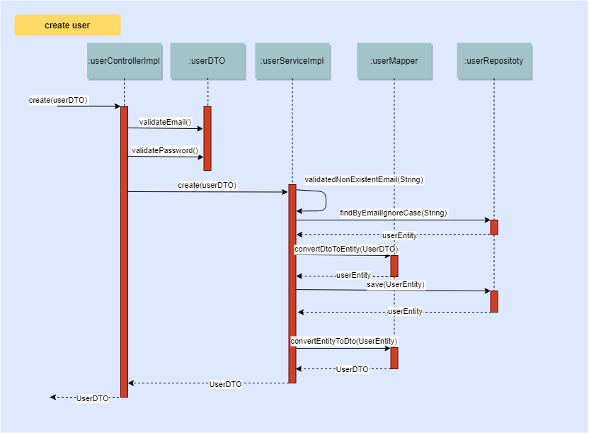

# Enunciado

Desarrolle una aplicación que exponga una API RESTful de creación de usuarios.

Todos los endpoints deben aceptar y retornar solamente JSON, inclusive al para los mensajes de error.

**Los mensajes de error deben tener el siguiente mensaje:**
  
    { 
      "mensaje": 
      "mensaje de error"
    }

***
## Consideraciones generales

* Todos los enpoint tiene que devolver el código de status HTTP adecuado.
* Se debe hacer traza de logs dentro del aplicativo.

***
## Registro

* El endpoint deberá recibir un usuario con los campos "nombre", "correo", "contraseña", más un listado de objetos "teléfono". El formato del JSON de entrada tiene que ser el siguiente:

      {
        "name": "Juan Rodriguez",
        "email": "juan@rodriguez.org",
        "password": "hunter2",
        "phones": [
          {
            "number": "1234567",
            "citycode": "1",			
            "contrycode": "57"
          }
        ]
      }

* En caso de éxito, retorne el usuario y los siguientes campos:
  * id: id del usuario (puede ser lo que se genera por el banco de datos, pero sería más deseable un UUID).
  * created: fecha de creación del usuario.
  * modified: fecha de la última actualización de usuario.
  * last_login: del último ingreso (en caso de nuevo usuario, va a coincidir con la fecha de creación).
  * token: token de acceso de la API (puede ser UUID o JWT).
  * isactive: Indica si el usuario sigue habilitado dentro del sistema.
* En caso que el correo exista en la base de datos, deberá retornar un error "El correo ya registrado".
* correo debe seguir una expresión regular para validar que formato sea el correcto. (aaaaaaa@dominio.cl)
* La clave debe seguir una expresión regular para validar que formato sea el correcto. (Una Mayúscula, letras minúsculas, y dos números)
  * ^                 # start-of-string
  * (?=.*[0-9]{2,})   # a digit must occur at least once
  * (?=.*[a-z])       # a lower case letter must occur at least once
  * (?=.*[A-Z])       # an upper case letter must occur at least once
  * (?=.*[@#$%^&+=])  # a special character must occur at least once
  * (?=\S+$)          # no whitespace allowed in the entire string
  * .{8,}             # anything, at least eight places though
  * $                 # end-of-string
* El token deberá ser persistido junto con el usuario

***
## Requisitos mandatorios
* Banco de datos en memoria.
* Gradle como herramienta de construcción.
* Pruebas unitarias (Deseable: Spock Framework).
* Persistencia con Hibernate.
* Framework Spring Boot.
* Java 8 o superior. (Usar más de dos características propias de la versión)
* Entregar diagrama de componentes de la solución y al menos un diagrama de secuencia (ambos diagramas son de carácter obligatorio y deben seguir estándares UML).
* README.md debe contener las instrucciones para levantar y usar el proyecto.

***
## Requisitos deseables
* JWT cómo token

***
## Ejecución de la aplicación

**Requerimientos**
* Tener instalado la JDK 11
* Tener instalado Gradle 6.5.1

> Nota: Para ejecutar los siguientes comandos Gradle nos tendremos que ubicar dentro de la carpeta raíz del proyecto y para ejecutar el jar tendremos que ubicarnos dentro de la carpeta build/libs del proyecto

### Forma: Directo desde gradle

Si solo queremos ejecutar el API una vez podemos ejecutarlo directamente con el siguiente comando gradle

    gradle bootRun

### Forma: Generando el jar

Si nuestra intención es correr varias veces el API o generar algún contenedor para ejecutarla, lo más conveniente es generar el jar de nuestra API.

Para esto solo tenemos que ejecutar el siguiente comando gradle:

    gradle build

Una vez que tenemos el jar solo tendremos que ejecutarlo mediante el siguiente comando:

    java -jar api-users.jar

### Modo de utilización del API
Para facilitar el uso y pruebas de las APIs, se dejó dentro de la carpeta raíz del proyecto el archivo **R_API_USER.postman_collection.json** el cual es un proyecto **Postman** el cual consta de un ejemplo de invocación de cada método que expone el API de usuario.

El proyecto consta con una capa de seguridad, la cual solo deja acceder a métodos de **alta de cliente** y **login** sin la necesidad de enviarle un token de autentificación.

Como se solicita en el enunciado, cuando se crea el usuario de retorna el **token**, por lo cual el método de **login** no es realmente necesario invocarlo.

> Nota: si bien en los ejemplos los métodos de get, put y delete tienen un id de usuario, este está solo a modo ilustrativo. Esto se debe a que la base de datos que utiliza el API se encuentra en memoria, por lo cual cada vez que se levanta el API la base de datos se vuelve a crear. Por tal motivo para poder ejecutar esos métodos se tiene que remplazar el id de ejemplo por el que devuelve el método post.

***
## Diagramas

### Diagrama de componente

### Diagrama de secuencia
